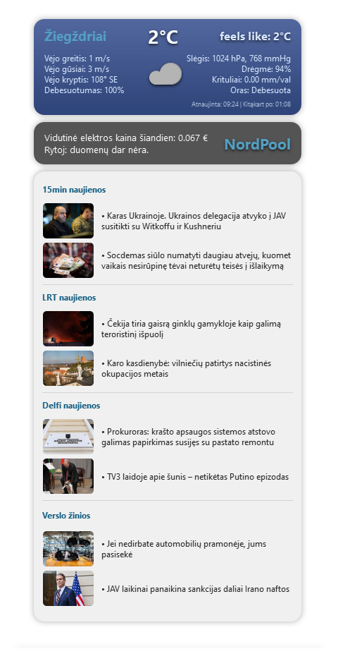

# Apie:



Ši programa naudoja `PyQT` biblioteką, kad sukurtų grafinį langą, kuris atvaizduoja orų informaciją, NordPool elektros kainas ir naujienas iš įvairių šaltinių.

## Diegimo instrukcijos

1. Įdiekite reikalingas bibliotekas:
   ```sh
   pip install -r requirements.txt 
2. Jei orų informacijai naudosite wether.py, config.py faile šakniniame programos kataloge, įrašykite savo API KEY.
   ```sh
    key = "api_key"  # Enter your API KEY
    location = "city"  # Enter city
3. Paleiskite programą:
    ```sh
   python run.py
   
### Ši programa naudoja šias papildomas bibliotekas:

1. **pillow==11.0.0**
    - Išplėstinė vaizdų apdorojimo biblioteka, naudojama orų ir vėjo krypties ikonų perdirbimui ir atvaizdavimui.

2. **pynordpool==0.2.3**
    - Biblioteka, skirta NordPool elektros kainų duomenų gavimui.
